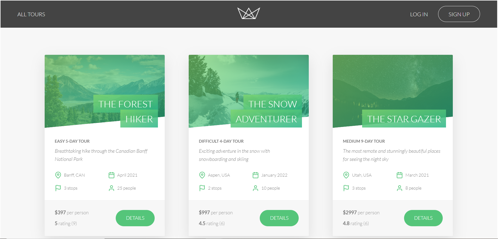
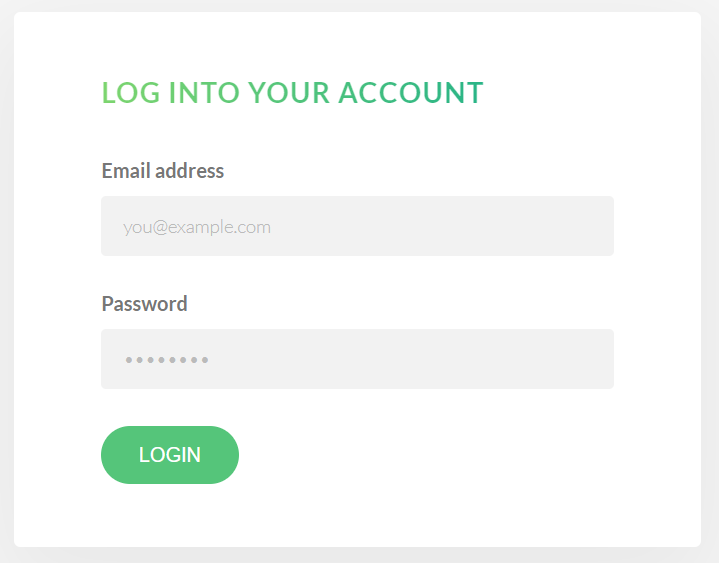
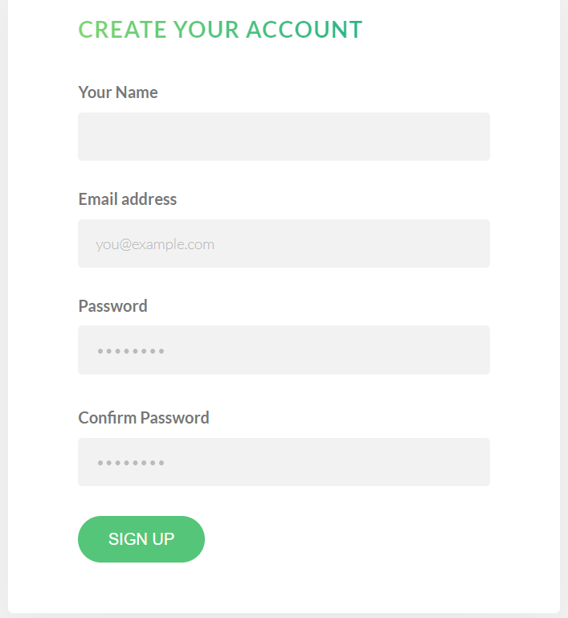
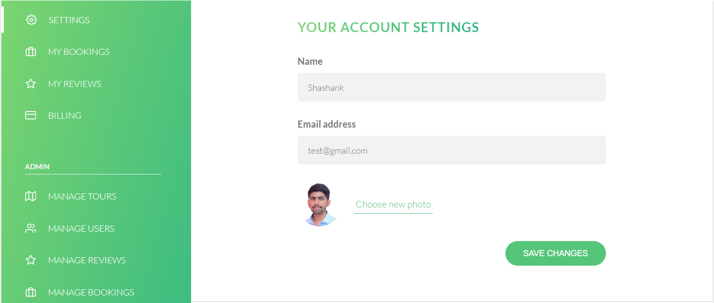
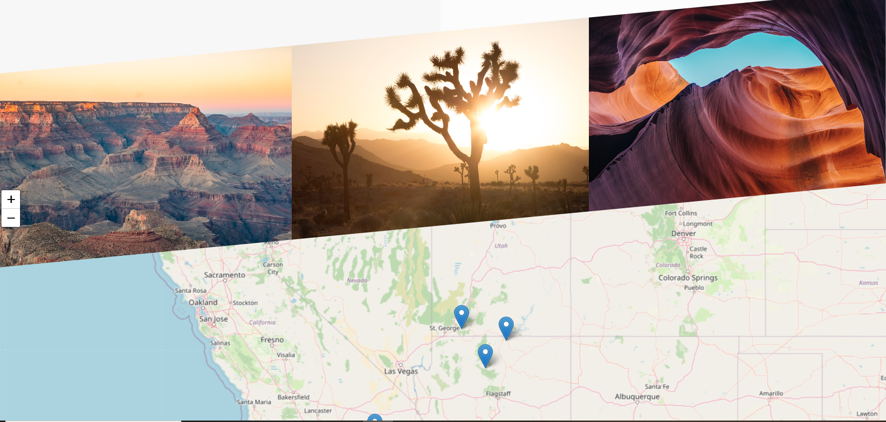

# node project

## **Natours** - Tour Booking Website

Click here for a <a target="_blank" href=""> DEMO </a>

## Introduction

Welcome to **Natours**, a beautiful tour booking website built using **Node.js**. Natours allows users to discover and book amazing tours, write reviews about their experiences, and make secure payments using credit cards.My sincere thanks to JONAS SCHMEDTMAN for an amazing course node.js, express and MongoDB - The complete bootcamp on udemy. This README provides an overview of the application, installation instructions, and details about the project's structure.

## Features

- **User authentication**: Users can sign up and log in to the application to access exclusive features.
- **Tour browsing**: Users can explore a wide range of available tours, each with detailed information and photos.
- **Tour booking**: Users can select their preferred tour and book it for their desired dates.
- **Review system**: After completing a tour, users can share their thoughts by leaving a review and a rating.
- **Secure billing**: Payment processing is handled through a secure credit card system for a seamless checkout experience.

## Technologies Used

- **Node.js**: Server-side JavaScript runtime environment.
- **Express.js**: Web application framework for Node.js.
- **MongoDB**: NoSQL database for storing tour, user, and review data.
- **Mongoose**: MongoDB object modeling for Node.js.
- **Stripe**: Payment processing API for handling credit card transactions.
- **HTML/CSS**: Front-end markup and styling.
- **Bootstrap**: Front-end framework for responsive design.
- **Pug.js**: For rendering HTML document to text
- **Mapbox**: Map functionality for describing locations

## Project Structure

The project follows a standard directory structure:

- **`app.js`**: Entry point of the application where Express app is initialized.
- **`routes/`**: Contains route handlers for different features (e.g., tours, users, reviews).
- **`controllers/`**: Implements the logic for different routes and business operations.
- **`models/`**: Defines Mongoose models for MongoDB data schema.
- **`views/`**: Contains server-rendered view templates using Pug or any other templating engine.
- **`public/`**: Stores static assets (e.g., CSS, images) used in the frontend.
- **`config/`**: Houses configuration files and environment variables.
- **`middlewares/`**: Custom middleware functions used in the application.
- **`utils/`**: Utility functions and helper modules.
- **`tests/`**: Includes test suites to ensure code quality and functionality.

## Installation

Clone the repository and install dependencies using npm:

`npm install`

## Usage

Start the development server:

`npm run dev`

This will open the app in your default browser.

Build the app for production:

`npm run build`

## Contributing

If you find any issues or have suggestions for improvement, please open an issue or submit a pull request on GitHub.
